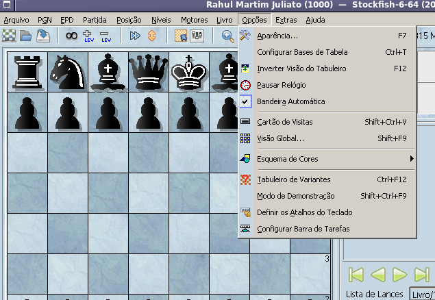

# pt_BR Translation to: ARENA CHESS GUI

Arquivo de tradução para Português Brasileiro do software Arena 3.5.x, uma excelente interface gráfica para engines de xadrez que roda com protocolo Xboard ou UCI (disponível em www.playwitharena.de)

## Como instalar

* Faça o download do Arena 3.5.x no site oficial;
* Baixe o arquivo de tradução Portugues_Brasil-3.5.x-r03.lng.zip;
* Descompacte o arquivo e copie o arquivo .lng para a pasta Languages;
* Inicie o arena;
* Selecione a língua do sistema em Extras -> Choose Language
* Para reportar eventuais erros, sugestões ou sugerir colaborações, entrar em contato através do e-mail rahul.juliato@gmail.com

## Screenshot

